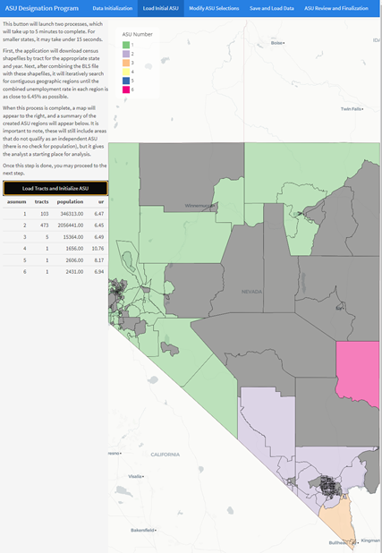
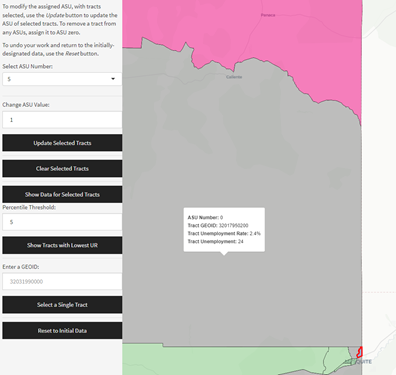
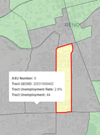

```{r, include = FALSE}
knitr::opts_chunk$set(
  collapse = TRUE,
  comment = "#>"
)
```

## About ASUloadR

ASUloadR is an application built in R using Shiny and Flexdashboard to create a point-and-click environment to build Areas of Substantial Unemployment (ASU). While this package does not replace the work of an analyst in a state from working on the ASU process, it provides tools to make that process more straightforward.

It should be noted, the U.S. Bureau of Labor Statistics has several options for designating ASUs. **ASUloadR** only uses the addition method, building regions at the Census Tract level. Analysts may discover that other alternatives work better for their state in a given year.

The ASU creation logic in this program was created by a collaboration between the states of Ohio and Nevada, with the Shiny app and Graphical User Interface designed by Nevada's Research & Analysis Bureau.

The Github repository for this package can be found at <https://github.com/schmidtDETR/ASUbuildR>

## About the ASU Process

The ASU process typically begins when the U.S. Bureau of Labor Statistics distributes to each state a file providing the calculated inputs for regions within the state from which ASUs must be designated. This is provided as an Excel sheet with a filename like `ST_asuYY.xlsx` where ST is the state abbreviation and YY is the year for which the ASU is being designated. **ASUloadR** is currently designed to pull information directly from this file, including identifying the state and year for which data should be retrieved.

Because this file is built using public information but using preliminary LAUS data for June of the current year, archives of these files are not publicly available but also do not contain confidential information. Future versions of ASUloadR may build these input files directly, but currently the state-specific input file is required.

ASUs are required to meet three elements to be considered. First, the region must be geographically contiguous (including corner-to-corner intersections). Second, the region must have a population of at least 10,000. Third, the unemployment rate in the region must be at least 6.5%. The methodology in **BLSloadR** looks at each census tract with an unemployment rate of at least 6.45%, then adds the adjacent tract with the next-highest unemployment rate (or a labor force of 0), and continues until the unemployment rate in the combined region is \<6.45%. It then removes the last-added tract, designates the region as an ASU, and continues with the next-highest remaining unused tract in the state. It continues building regions until there are no remaining tracts with a rate of at least 6.45%, then stops.

## Using ASUloadR

The basic functionality of **ASUloadR** is simple. First, install the package. Second, call the `launch_ASUloadR()` function. If you prefer, you don't even have to load the package into your library, just call it directly with `ASUloadR::launch_ASUloadR()`. By default, this will launch the **ASUloadR** Shiny app in your default browser window.

### Basic Navigation

Within the app window, there are a series of tabs across the top. These control the basic navigation within the app. The functionality of each tab will be described in detail below.

-   Data Initialization: this is where you load the Excel file from BLS.

-   Load Initial ASU: here you use the data from BLS to generate an initial list of potential ASUs.

-   Modify ASU Selections: this is the primary window you will interact with. It allows for the manipulation and refinement of the data.

-   Save and Load Data: this allows you to save the current state of the modified data and maps to be loaded later. If you have already saved data, you can come straight here to load that map.

-   ASU Review and Finalization: this tab contains tools to review the summarized ASUs, to generate an output CSV file to review individual tracts, and to generate a batch TXT file that can be uploaded to BLS.

### Data Initialization

To begin the ASU building process, click the `Browse` button on the left side of the page. Once a file has been selected, an overview of the file will appear on the right to confirm the file has successfully loaded. You may review the contents of the columns to ensure that data appears to be loaded correctly. This script assumes the columns are maintained in a consistent order by BLS - changes to the structure of the file will require updates to the structure of this code.

When review is complete, continue to the next tab - Load Initial ASU.

### Load Initial ASU

To begin the ASU designation process, click the `Load Tracts and Initialize ASU` button. This will execute the tract-by-tract ASU building process. Small states may see this process run in under 20 seconds. The largest states may take up to 5 minutes. When the process is complete, the app will render a map to on the right side of the page. The number of colors on this map is limited to 8, so if more than 8 potential ASUs are identified, more than one ASU will use the same color.

In addition, note that a table of the potential ASUs will appear below the button. This will give the analyst a sense of how many tracts may be worth merging into larger ASUs. In general, regions with 3 or fewer tracts are unlikely to meet the population threshold to qualify as an ASU.

To begin manipulating the data, proceed to the next tab, Modify ASU Selections. Or, if the number of modifications is large or the state takes a long time to run, skip ahead to perform an initial save of the data on Save and Load Data.

### Modify ASU Selections

This tab is where all edits to the ASU selections are made. A number of tools are provided to aid in the optimization of the ASUs. In general, *selected* tracts will be outlined in red on the map.

-   Hover over the map. Hovering the mouse over the map will display information about that tract useful to the selection process.

-   Click on the map. Clicking on the map will select, or unselect, a particular tract.

-   Select ASU Number: This dropdown allows you to select all the tracts in a particular ASU. If you select None, this will effectively clear all selected tracts.

-   Change ASU Value / Update Selected Tracts: This is how you change the pre-assigned ASU number. Enter the numeric value in the box under *Change ASU Value:* and then click the *Update Selected Tracts* to change the value. The numeric value remains in the box, providing a convenient way to keep changing tracts or groups of tracts to the same ASU. Further, changing the ASU number to 0 is how selected tracts are removed from any ASUs.

-   Show Data for Selected Tracts: This will generate a table below the map which has the aggregated ASU data for all selected tracts. This may help with determining whether it is efficient to add a tract or group of tracts to an existing ASU.

-   Percentile Threshold / Show Tracts with Lowest UR: This allows you to enter a numeric value (0-100) which will highlight the tracts within the current selection that have the lowest unemployment rates. As the analyst changes ASUs, this helps identify tracts which might be good candidates to remove from an ASU to add others in. While the algorithm will add tracts until the combined rate is as low as possible, it does not know whether a tract with low unemployment would be useful to "bridge" to a further high unemployment tract that could not otherwise qualify as an ASU. *Note: this functionality currently **removes highlighting from still-selected tracts**. To make changes, please Clear Selected Tracts, then select the tract you wish to modify.*

-   Enter a GEOID / Select a Single Tract: This functionality is most useful when using the CSV output that this app generates on the **ASU Review and Finalization** tab. Given the 11-character GEOID, you can input that to highlight a single tract to examine where it fits. This can be helpful for fine-tuning - reviewing the highest-unemployment tracts not included in an ASU to ensure they cannot be connected in to improve the ASU.

-   Reset to Initial Data: This button will reset all changes you have made to the state of the map after the **Load Initial ASU** process. For when you've just broken everything and want to start over. Use with caution!

### Save and Load Data

This tab contains some simple options to help save and load the current state of the map. While Nevada had only 6 initial ASUs to review other states may have over 100! This will save the background data of the app as an RDS file, or load data from an RDS file.

To specify a directory other than your working directory, paste that directory into the `Save Directory Path` box.

### ASU Review and Finalization

This will typically be the last screen in the process. Here, you may test the ASUs you have created against the required numeric thresholds using `Generate ASU Summary` - this is most useful for validating edge cases, when the calculated aggregate ASU rate is less than but rounds up to 6.45. Because the criteria for an ASU is an unemployment rate of 6.5%, a rate of 6.449% will not qualify. The TRUE/FALSE outputs in the table provide the most reliable test for whether the ASU will qualify.

Generate LSS .txt File and Create Summary CSV will both create files in the directory specified in the **Save and Load Data** tab (or your working directory). The LSS TXT file should be formatted to be able to upload to LSS directly once the ASUs are completed. The Summary CSV file provides a handy output of all selected tracts and a useful tool to review the selections for high-unemployment tracts that were not included.

## ASU Strategies

When building the ASU, in general the larger the area the more flexibility you have in bridging across areas of low unemployment to reach areas of high unemployment. Because WIOA allocations are based on the number of unemployed individuals in ASUs, maximizing unemployment within all combined ASUs is likely a top priority.

This is the reason why the initial selection still includes ASUs without sufficient population to qualify on their own. By connecting to these areas, the qualifying ASU may be able to increase total unemployment.

In the image below, we see that there are initially 6 potential ASUs for Nevada. Some of these regions already touch, because the initial algorithm starts from the highest tract and builds outward. Unless a potential bridge between high unemployment areas is selected, the search may go elsewhere until a new area is built. It may include the bridge tract, but does not combine the regions. There are also three isolated tracts, which we should try to connect!



At first, the total unemployment in qualifying ASUs is 66,151 + 10,776 + 323 = 77,250, so improving on this number is our goal.

First, I will join ASUs 1, 2, and 3 together. I will **Select ASU Number** 2 and then **Change ASU Value** to 1, then the same for ASU 3.

ASU 6 is easy to spot, it's the large pink area in northern Lincoln County. But ASU 4 and ASU 5 are harder to see. Fortunately, selecting them in the drop down will zoom to their location. Looking at ASU 5, it appears that I only need to add one tract - the large grey area in southern Lincoln County - to connect them both to my new ASU #1. Clicking on all thee tracts, I use **Show Data for Selected Tracts** to see that the combined unemployment for these areas is 5.71%. Definitely worth trying to add!



I change the areas and add them to ASU #1. Now my final tract - ASU #4. It is an urban tract in Reno, and just one tract away from ASU #1. The best bridge tract has an unemployment rate of just 2.8%, but let's see if we can merge these two in.



I change these two tracts to ASU #1 as well. Now I select all of ASU #1 and click **Show Data for Selected Tracts** again. I now appear to have total unemployment of 77,571 with an unemployment rate of 6.45%. To double-check, I go to the **ASU Review and Finalization** tab and **Generate ASU Summary**. Sure enough, it looks like this combined region will qualify. By making the combined area larger, I was able to add a few more tracts to the overall ASU and increase total unemployment in the ASU.
